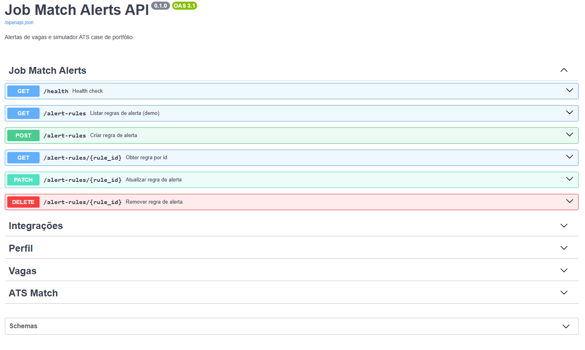
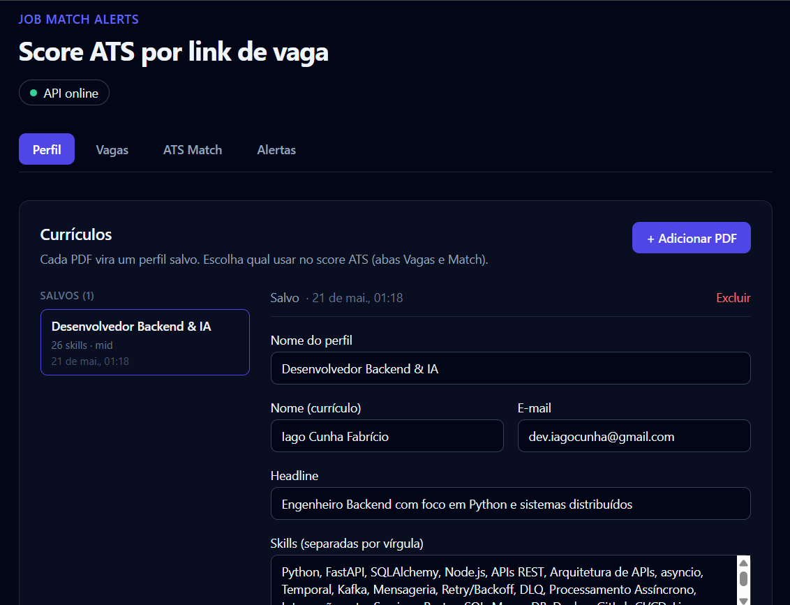
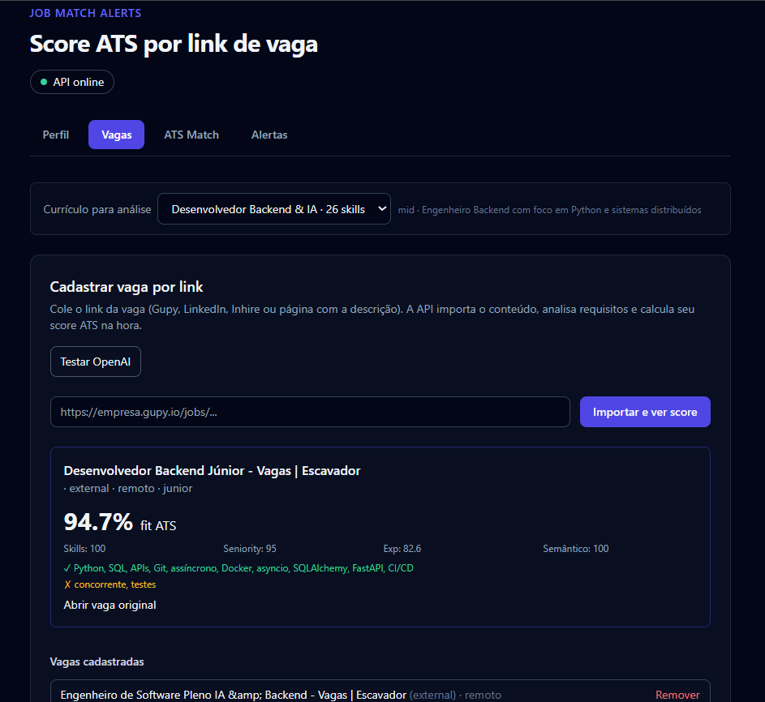
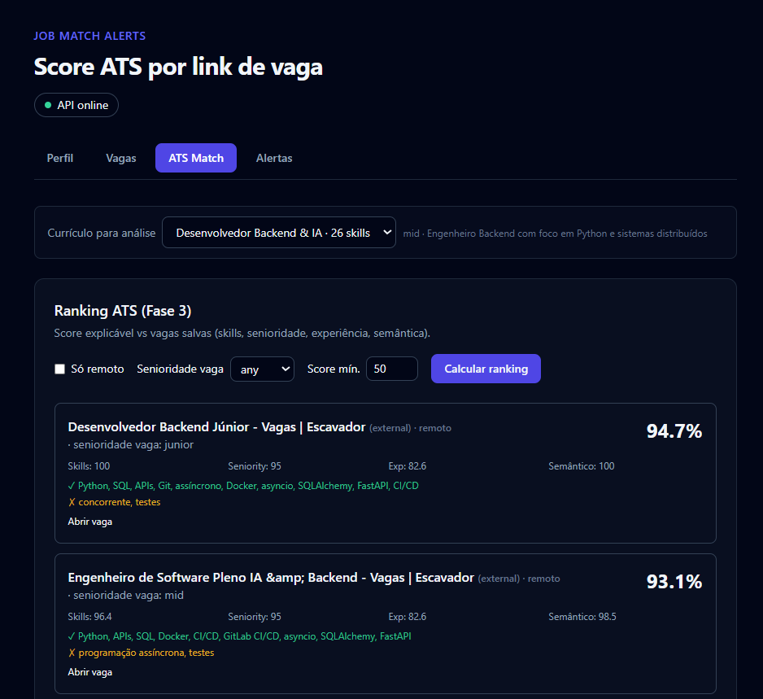

# Job Match Alerts

Simulador ATS e pipeline de matching candidato–vaga via API REST, com FastAPI, PostgreSQL, React e motor de score explicável.

> **Case de portfólio**: demonstra ingestão de currículo/vaga, parse estruturado e ranking ATS. Não é produto comercial nem substituto de plataformas de emprego.

## Features

- Upload de currículo em PDF com texto integral editável e **múltiplos perfis** salvos
- Import de vaga por URL (Gupy, LinkedIn, Inhire e páginas com `JobPosting` / meta tags)
- Extração opcional de skills e senioridade da vaga com **OpenAI**
- **Motor ATS** determinístico com breakdown (skills, senioridade, experiência, match semântico)
- Score imediato ao importar vaga + ranking entre vagas cadastradas
- API REST documentada em OpenAPI/Swagger (`/docs`)
- SQLAlchemy 2 async + PostgreSQL; Redis reservado para filas (alertas)
- Monorepo: `apps/api` (FastAPI) + `apps/web` (React + Vite + TypeScript)
- Docker Compose para ambiente local reproduzível
- Health check em `GET /health`
- Testes Pytest no motor ATS e health; CI no GitHub Actions

## Demo online

| Camada | URL | Observações |
|--------|-----|-------------|
| **UI** (Vercel) | [job-match-alerts.vercel.app](https://job-match-alerts.vercel.app) | Fluxo Perfil → Vaga → Score |
| **API** (Render) | [job-match-alerts.onrender.com](https://job-match-alerts.onrender.com) | [Swagger `/docs`](https://job-match-alerts.onrender.com/docs) · [Health](https://job-match-alerts.onrender.com/health) |
| **DB** | Supabase (Session pooler) | `DB_*` no Render, sem `DATABASE_URL` |

> Render free dorme ~30s no primeiro hit; PDFs em `/tmp/uploads` somem no restart do container.

Passo a passo de deploy: [docs/DEPLOY.md](./docs/DEPLOY.md).

Prévia da documentação e da UI (arquivos em [`docs/images/`](./docs/images/)):



## Demonstração (screenshots)

### 1) Documentação da API (`/docs`)

Endpoints agrupados por domínio: alertas, integrações, perfil, vagas e ATS Match.


### 2) Perfil — múltiplos currículos

Upload de PDF, lista de perfis salvos e edição de skills/headline.



### 3) Vaga por link — score na hora

Import da URL com currículo selecionado; breakdown e skills matched/missing.



### 4) Ranking ATS

Comparação do perfil ativo com todas as vagas cadastradas.



## Objetivo

MVP que mostra, de forma legível para quem revisa o repositório:

1. **Ingestão**  PDF do currículo e HTML da vaga.
2. **Estruturação**  campos para matching (skills, senioridade, texto bruto).
3. **Decisão ATS simulada**  score % com matched/missing e breakdown, sem caixa-preta.

Não compete com ATS comerciais; o foco é **código do motor + API + demo** no portfólio.

## Créditos e uso

Este projeto está sob **[MIT License](./LICENSE)**.

Você pode usar, estudar, forkar e adaptar o código **desde que**:

1. Mantenha o aviso de copyright da licença MIT nos arquivos distribuídos.
2. **Credite o autor** com link para este repositório (ex.: *“Baseado em [Job Match Alerts](https://github.com/oiagocunha/job-match-alerts) por Iago Cunha Fabrício”*).

Não é necessário permissão prévia para uso educacional ou portfólio; só não apresente o projeto como se fosse seu sem atribuição.

## Tecnologias utilizadas

- Python 3.11+
- asyncio · FastAPI · httpx · SQLAlchemy 2 (async) · asyncpg · pypdf
- PostgreSQL · Redis (fila futura)
- React 18 · Vite · TypeScript · Tailwind CSS
- Docker · Docker Compose
- OpenAI API (opcional  parse de currículo e análise de vaga)
- Pytest · Ruff · GitHub Actions

## Requisitos

- [Docker](https://www.docker.com/) e [Docker Compose](https://docs.docker.com/compose/)
- [Node.js](https://nodejs.org/) 20+ (frontend local)
- Chave [OpenAI](https://platform.openai.com/) no `.env` para parse/análise com LLM (sem chave, heurísticas + motor ATS ainda funcionam em parte)

## Configuração

1. Clone o repositório:

```bash
git clone https://github.com/oiagocunha/job-match-alerts.git
cd job-match-alerts
```

2. Copie o ambiente de exemplo:

```bash
cp .env.example .env
# Windows (PowerShell): Copy-Item .env.example .env
```

3. Edite `.env`:

- `OPENAI_API_KEY`  recomendado para parse do PDF e skills da vaga.
- `DATABASE_URL`  no Docker use host `db`; na API local use `localhost:5433` (veja `.env.local.example`).

> **Nunca** commite `.env` ou a pasta `uploads/` (currículos em PDF).

## Uso

### Backend (Docker)

```bash
docker compose up -d --build
```

- API: http://localhost:8002  
- Swagger: http://localhost:8002/docs  
- Health: http://localhost:8002/health  

### Frontend

```bash
cd apps/web
npm install
npm run dev
```

- App: http://localhost:5173 (proxy `/api` → API local)

### Fluxo na UI

1. **Perfil**  `+ Adicionar PDF` → currículo salvo na lista.
2. **Vagas**  escolha o currículo no seletor → cole URL → **Importar e ver score**.
3. **ATS Match**  mesmo currículo → **Calcular ranking** nas vagas salvas.

### Exemplos via API

Health:

```bash
curl http://localhost:8002/health
```

Listar currículos:

```bash
curl http://localhost:8002/profiles
```

Importar vaga (com perfil `id=1`):

```bash
curl -X POST "http://localhost:8002/jobs/import?analyze=true&profile_id=1" \
  -H "Content-Type: application/json" \
  -d "{\"url\": \"https://empresa.gupy.io/jobs/SEU-ID\"}"
```

Ranking ATS:

```bash
curl "http://localhost:8002/match/rank?profile_id=1&min_score=0&limit=10"
```

## Arquitetura (visão rápida)

```text
Browser (React / Vercel)
        ↓  REST + multipart
FastAPI (rotas · validação · OpenAPI)
        ↓
Serviços
  · profiles    PDF → texto + JSON estruturado
  · job_import  HTTP → HTML → metadados da vaga
  · ai          OpenAI (opcional)
  · ats_engine  score ponderado + explicação
  · jobs / match / alert_rules
        ↓
PostgreSQL (+ uploads em disco no volume)
```

Detalhes: [docs/ARCHITECTURE.md](./docs/ARCHITECTURE.md) · fontes de vaga: [docs/JOB_SOURCES.md](./docs/JOB_SOURCES.md).

## Motor ATS (resumo)

Pesos configuráveis em `apps/api/app/services/ats_engine.py`:

| Dimensão | Peso | Ideia |
|----------|------|--------|
| Skills | 35% | overlap obrigatórias / desejáveis |
| Senioridade | 20% | faixa da vaga vs perfil |
| Experiência | 25% | anos por stack (quando informado) |
| Semântico | 20% | similaridade título + descrição vs skills do candidato |

Resposta inclui `score`, `breakdown`, `matched`, `missing` e `explanation[]`.

## Endpoints principais

| Método | Rota | Descrição |
|--------|------|-----------|
| `GET` | `/health` | Health check |
| `GET` | `/profiles` | Listar currículos |
| `GET` | `/profiles/{id}` | Detalhe do currículo |
| `POST` | `/profiles/parse` | Upload PDF → novo perfil |
| `PUT` | `/profiles/{id}` | Atualizar perfil |
| `DELETE` | `/profiles/{id}` | Remover perfil |
| `POST` | `/jobs/import` | Cadastrar vaga por URL + score (`profile_id` opcional) |
| `GET` | `/jobs` | Listar vagas |
| `DELETE` | `/jobs/{id}` | Remover vaga |
| `GET` | `/match/rank` | Ranking ATS (`profile_id`, filtros) |
| `POST` | `/match/jobs/{id}` | Score para uma vaga |
| `GET` | `/alert-rules` | Regras de alerta (demo) |
| `GET` | `/integrations/status` | Status OpenAI |
| `GET` | `/docs` | Swagger UI |

## Estrutura do repositório

```text
job-match-alerts/
  apps/
    api/app/
      api/routes/    # FastAPI routers
      core/          # config, CORS, env
      db/            # engine, migrações leves
      models/        # SQLAlchemy
      schemas/       # Pydantic
      services/      # ats_engine, ai, job_import, profiles…
    web/src/         # React UI
  docs/              # arquitetura, deploy, imagens
  docker-compose.yml
  .github/workflows/ci.yml
```

## Decisões técnicas

### Monorepo com demo fixa

`demo_user_id` fixo simplifica o case (sem auth). Produção real exigiria usuários, JWT e isolamento de perfis.

### Migrações leves no boot

`create_all` + SQL pontual em `app/db/migrate.py`  adequado para portfólio; produção madura usaria Alembic.

### Import por URL (não agregador)

Evita dependência de APIs pagas de vagas. HTML de terceiros muda; scrapers podem quebrar  documentado em [JOB_SOURCES.md](./docs/JOB_SOURCES.md).

### OpenAI opcional

Sem chave: heurística no PDF e score ATS com skills inferidas manualmente ou vazias. Com chave: parse estruturado e `skills_analysis` da vaga.

### Múltiplos currículos

Cada PDF é um registro; `profile_id` em match/import permite comparar versões do CV (ex.: PT vs EN).

## Tradeoffs e roadmap

| Item | Estado |
|------|--------|
| Motor ATS + ranking | Feito |
| Múltiplos perfis + seletor na UI | Feito |
| Import URL (Gupy / LinkedIn / Inhire) | Feito |
| Otimizador de currículo (Fase 4) | Planejado |
| Alertas por e-mail + Redis (Fase 5) | Planejado |
| Auth multi-usuário | Fora do escopo do case |
| Scraping em escala / ToS de plataformas | Uso educacional apenas |

## Testes e CI

```bash
cd apps/api
pip install -e ".[dev]"
pytest tests -q
ruff check app tests
```

No push/PR, o workflow [.github/workflows/ci.yml](./.github/workflows/ci.yml) roda Pytest (com Postgres), Ruff e build do frontend.

## Licença

[MIT License](./LICENSE)  Copyright (c) 2026 Iago Cunha Fabrício.
